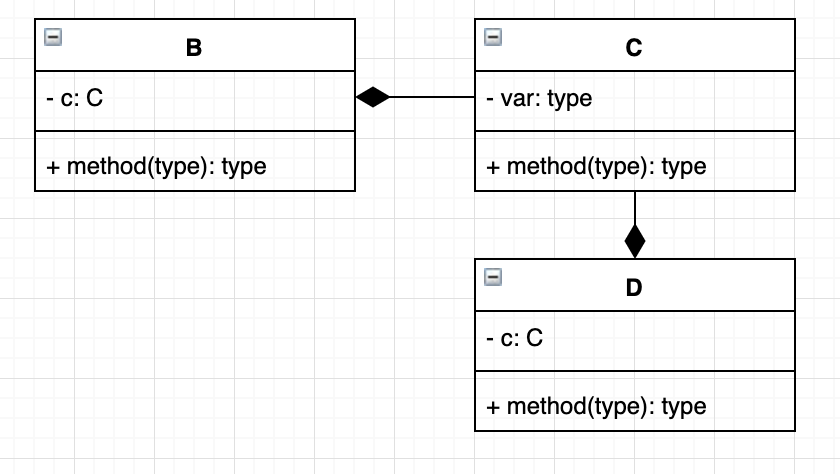
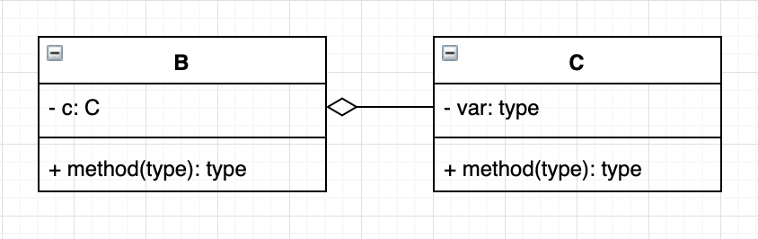

# Unified Modeling Language (UML)
**UML** show dependencies between classes. Here are some properties:
* classes names are on top
* ```+``` represents a public member
* ```-``` represents a public member
* arrows represent inclusion of another class
* **weak association** includes parameter of another class
* **strong association** holds reference to an instance of another class
* **Aggregation** shared association
  * class B can be part of other classes (class A is not an exclusive container of class B)
  * use an open diamond



* **Composition** not shared association
  * class A has exclusive ownership over class B
  * use a solid diamond



* numbers on either side of arrow to represent the multiplicity relationship
* order: class name, member vars, member functions
