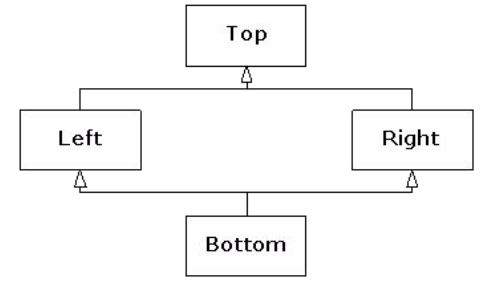
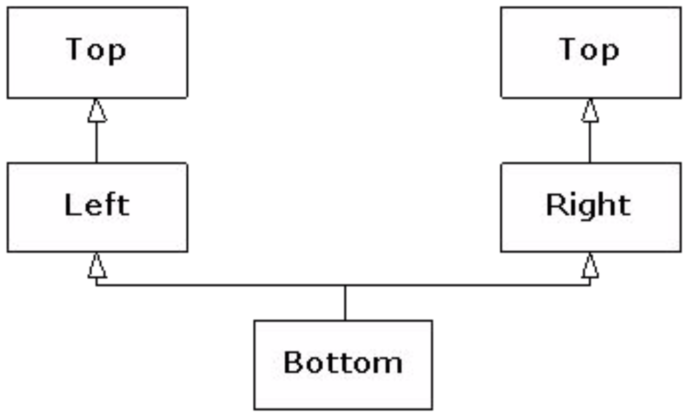
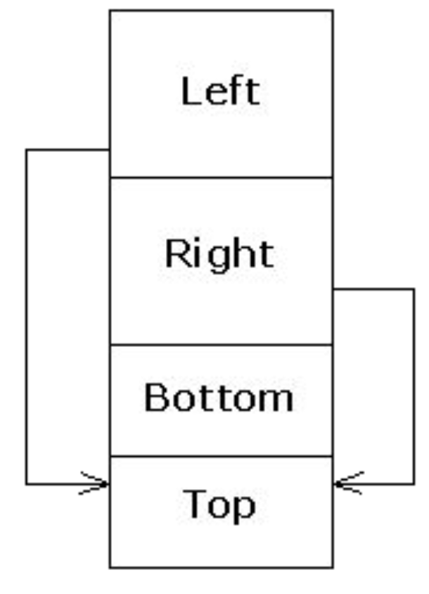

# Inheritance Basics
Object oriented programming provides a dimension of abstraction known as **inheritance**. The process by which a new class, known as the **derived class**, is created from another class known as the **base class**.

The derived class has all the member vars and all ordinary member functions that the base class has. In the derived class, we only include the declaration of an inherited member function if you want to change its definition. To have a derived class inherit from a base class:
```cpp
class DerivedClass : public baseClass {
    // want to change definition of inherited member function
    void inheritedFn();
}
```

## Properties of Derived Classes
1. derived classes can add new member vars and functions
2. derived classes are objects of the base class, but not vice versa. we can assign an object of the derived class to one of the base class, but we introduce the **slicing problem**
3. derived classes do not have access to private vars or functions from the base class.

## "Is a" vs "Has a" Relationship
* "Is a" - inheritance (e.g. a boy "is a" human)
* "Has a" - class contains objects from another class as memeber data (e.g. a boy "has a" toy)

# Inherited Members
The derived class has all the member vars and all ordinary member functions of base class. The inherited member functions and member variables are not mentioned in the declaration of the derived class, but are automatically members of the derived class, except for the following:
* constructors
* destructors
* copy constructor
* assignment operator
* private member functions

## Redefinition of Inherited Functions
If we want to change the definition of an inherited member function, we declare it in the definition of the derived class (called **redefining**). However, if the descendent class wants to use the base class function, we use the scope resolution operator with the name of the base class. i.e.
```cpp
derivedClass.baseClass::function();
```

## Assignment Operators and Copy Constructor
Overloaded assignment operators and copy constructors are not inherited, but they should be included in the derived class. The base class's assignment operators and copy constructors can be used in the derived class with scope resolution:
```cpp
Derived & Derived::operator=(const Derived & rhs) {
    Base::operator=(rhs);
}
```

Notice that we first invoke the base class assignment operator, then set the new variables of the derived class.

# Constructors
Constructors are not inherited, but can invoke a constructor of base class within the definition of a derived class constructor.C onstructors for derived classes begin with an invocation of a constructor for the base class which initializes all the data inherited from the base class. For example:
```cpp
HourlyEmployee:HourlyEmployee (const string & name, const string & id, double rate, rouble hours) :
Employee(name, id), wagerate {rate}, hours {hours} {

}
```

# Destructors
Destructors for derived classes automatically invoke the destructor for the base class, but it has to delete additional member variables it has defined. <br>
The order that the destructors are called is the opposite of how constructors are called: 

if class C derives class B which derives class A<br>
if an object class C goes out of scope, the order  of destructors are called in order: <br>
C -> B -> A

# Protected Qualifier
The **protected qualifier** allows variables and functions to be accessed by name in a derived class but not anywhere else. Protected members are inherited in the derived class as if they were marked protected in the derived class. e.g.
```cpp
protected int a;
```

# Protected and Private Inheritance
The kind of inheritance we have mentioned up til now are forms of **public inheritance**. The scope of the variables do not change as they are inherited (public and protected members are inherited as such, private members are not inherited).

There are also protected inheritance and private inheritance which are defined as such:
* **Protected inheritance** - members that are public in the base class are protected in the derived class when they are inherited:
```cpp
class SalariedEmployee : protected Employee {};
```
* **Private inheritance** - all members of the base class are inaccessible in the derived class:
```cpp
class SalariedEmployee : private Employee {};
```
* *Note: private and protected inheritance restricts access to inherited members when used by a derived class object, but the derived class still contains all base class data*

# Multiple Inheritance
A derived class can have more than one base class. We specify the base classes by separating them with commas. i.e.
```cpp
class DerivedMulti : public Base1, Base2 { 

};
```

## Interface Inheritance
In C++, all inheritance is **implementation inheritance** because everything in the base class, both interface and implementation, becomes part of the derived class.

To simulate interface in C++, we derive from an **interface class**, which is a pure abstract class that contains only declarations (no data or function bodies). These declarations will be pure virtual functions, except for the destructor.
```cpp
// Interface Classes
class Printable {
public:
    virtual ~Printable() {}
    virtual void print(ostream &) const=0;
};

class Intable {
public:
    virtual ~Intable() {}
    virtual int toInt() const=0;
};

class Stringable {
public:
    virtual ~Stringable() {}
    virtual string toString() const=0;
};

// Interface Inhertiance
class Able : public Printable, public Intable, public Stringable {
    int data;
public:
    Able(int x) { data=x; }
    void print(ostream & os) const { os << data; }
    int toInt() const { return data; }
    string toString() const {
        ostringstream os;
        os << data;
        return os.str();
    }
}

void testPrint(const Printable & p) {
    p.print(cout);
    cout << endl;
}
void testInt(const Intable & n) {
    cout << n.toInt() + 1 << endl;
}
void testString(const Stringable & s) {
    cout << s.toString() + "th" << endl;
}

int main() {
    Able a(7);
    testPrint(a); // 7
    testInt(a); // 8
    testString(a); // 7th
}
```

## Common Function Names
Consider the following example:
```cpp
class A { void foo(); };
class B { void foo(); };
class C: public A, public B {};

int main() {
    C c;
    c.foo(); // ERROR
}
```

The object ```c``` has 2 possible function ```foo()``` to choose from, class ```A```'s or class ```B```'s. Since the compiler does not know which one to call, it throws an error. To clarify which function we are calling, we qualify the function call with the corresponding base class's name. e.g.
```cpp
class C : public A, public B {
public:
    using A::foo();
}

int main() {
    C c;
    c.foo(); // calls A::foo()
}
```

# Duplicate Subobjects
When a base class is inherited, a copy of all data members of that base class is copied over to the derived class. Note the following:
```cpp
class A { int x; };
class B { int y; };
class C : public A, public B { int z; };

int main() {
    cout << "sizeof(A) == " << sizeof(A) << endl; // 4
    cout << "sizeof(B) == " << sizeof(B) << endl; // 4
    cout << "sizeof(C) == " << sizeof(C) << endl; // 12
    C c;
    cout << "&c == " << &c << endl; // 1245052
    A * ap = &c;
    B * bp = &c;
    cout << "ap == " << static_cast(ap) << endl; // 1245052
    cout << "bp == " << static_cast(bp) << endl; // 1245056
    C * cp = static_cast(bp);
    cout << "cp == " << static_cast(cp) << endl; // 1245052
    cout << "bp == cp? " << boolapha << (bp == cp) << endl; // true
}
```

Note the address of ```ap``` is the same as ```&c```, while ```bp``` is offset by 4 bytes. This indicates that the object ```c``` begins with its ```A``` subobject, then the ```B``` subobject, and finally the data from the ```C``` type.

When upcasting from ```C``` to ```A```, the resulting pointer points to the ```A``` portion which is at the beginning of the ```C``` object, and thus has the same address.

When upcasting to ```B```, however, the resulting pointer points to the ```B``` subobject, which is shifted 4 bytes up because the ```A``` subobject takes up 4 bytes (int).

When casting back from ```B``` to ```C```, since the original object was a ```C``` type, the pointer is shifted back to the original address of the complete ```C``` object.

When comparing ```bp == cp```, ```cp``` is implicitly converted to a ```B*``` since upcasting is always allowed (vs. downcasting), thus the result is true.

# Diamond Inheritance


When you have multiple base classes and those base classes have a common base class, you will have 2 copies of the original base class. The inheritance diagram, therefore, looks more like:



```cpp
class Top {
    int x;
public:
    Top(int n) : x {n} {}
};

class Left : public Top {
    int y;
public:
    Left(int m, int n) : Top {m}, y {n} {}
};

class Right : public Top {
    int z;
public:
    Right(int m, int n) : Top {m}, z {n} {}
};

class Bottom : public Left, public Right {
    int w;
public:
    Bottom(int i, int j, int k, int m) : Left(i, k), Right(j, k), w {m} {}
};

int main() {
    Bottom b(1,2,3,4);
    /*
    Top (Left):  x = 1
    Top (Right): x = 1
    Left:        y = 1
    Right:       z = 1
    Bottom:      w = 1
    */
   cout << sizeof b << endl; // 20 (5 * int)
}
```
This design is awkward because the user thinks that only 4 integers are rquired, but which are the 2 arguments that should be passed into ```Left``` and ```Right```? This also presents a problem if we try to convert a ```Bottom``` pointer to a ```Top``` pointer. But as shown ealier, the address may be readjusted and will be different dependeing on which of the 2 ```Top``` subobjects is chosen. 

Since this upcast is ambiguous, the compiler does not allow it. 

Another consequence is that the ```Bottom``` object would not be able to call a function defined in ```Top```.

# Virtual Base Class
In a true diamond inheritance, the ```Top``` object is shared by both ```Left``` and ```Right``` subobjects within the ```Bottom``` object. This is achieved by making the base class virtual.

```cpp
class Top {
protected:
    int x;
public:
    Top(int n) : x {n} {}
    virtual ~Top() {}
    friend ostream& operator<<(ostream& os, const Top & t) {
        return os << t.x;
    }
};

// virtual base class
class Left : virtual public Top {
protected:
    int y;
public:
    Left(int m, int n) : Top {m}, y {n} {}
};

// virtual base class
class Right : virtual public Top {
protected:
    int z;
public:
    Right(int m, int n) : Top {m}, z {n} {}
};

class Bottom : public Left, public Right {
    int w;
public:
    Bottom(int i, int j, int k, int m) : Top(i), Left(0, j), Right(0, k), w {m} {}
    friend ostream& operator<<(ostream & os, const Bottom& b) {
        return os << b.x << ", " << b.y << ", " << b.z << ", " << b.w;
    }
};

int main() {
    Bottom b(1,2,3,4);
    /*
    Bottom      : size = 4 (int)
    Left, Right : size = 4 (int) + 8 (ptr) = 12
    Top         : size = 8
    */
    cout << b << endl;  // 1,2,3,4
    cout << static_cast<void*>(&b) << endl; // 1245032
    Top* p = static_cast<Top*>(&b);
    cout << *p << endl;  // 1
    cout << static_cast<void*>(p) << endl;  // 1245060
    cout << dynamic_cast<void*>(p) << endl; // 1245032
}
```

Each virtual base of a given type refers to the same object, no matter where it appears in the hierarchy. The object diagram for ```Bottom``` looks something like this:



The ```Left``` and ```Right``` subobjects each have a pointer to the shared ```Top``` subobject. Note that because there is only a single instance of the ```Top``` object, the constructor is not called by the classes that inherit from it (```Left``` and ```Right```) as this would mean that the constructor is called multiple times. Instead, the constructor is called by the most-derived class ```Bottom```. The most derived class must initialize the virtual base.

Since all references to the ```Top``` subobject point to the same object, there is no ambiguity when upcasting to a ```Top``` object, so it is allowed.

With multiple inheritance, a derived object must behave as if it has multiple ```vptr```s, one for each of its direct base classes that have virtual functions.

# Dominance
When we have functions with the same name occurring in difference branches, dominance can be used figure out which function to call. **Dominance** favours the functions occurring in the most-derived class. i.e.
```cpp
class Top {
public:
    virtual ~Top() {}
    virtual void f() { cout << "Top called" << endl; }
};

// Left::f() > Top::f()
class Left : virtual public Top {
public:
    void f() { cout << "Left called" << endl; }
};

// Only has Top::f()
class Right : virtual public Top {};

class Bottom: public Left, public Right {};

int main() {
    Bottom b;
    b.f(); // calls Left::f();
}
```
