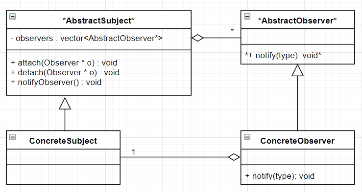
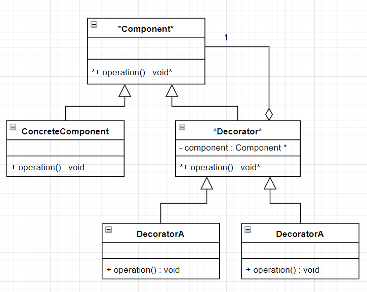
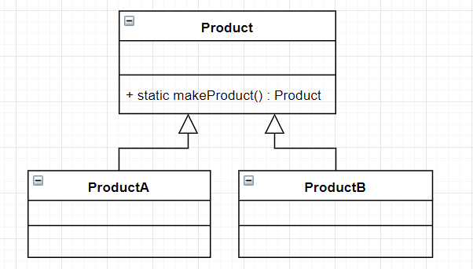
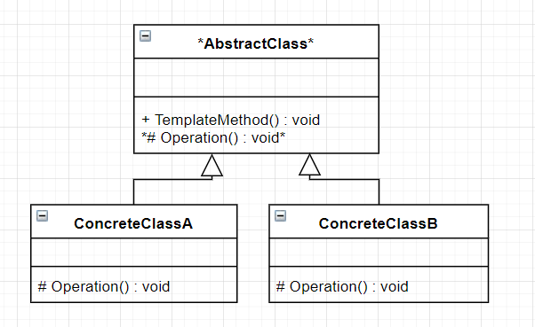
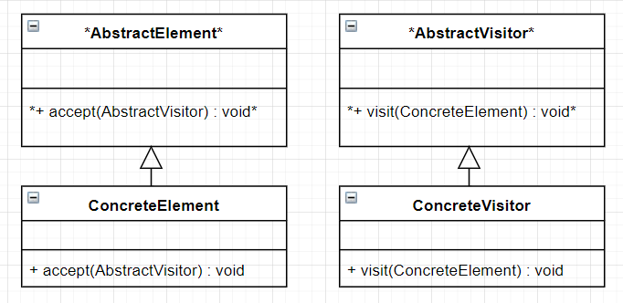
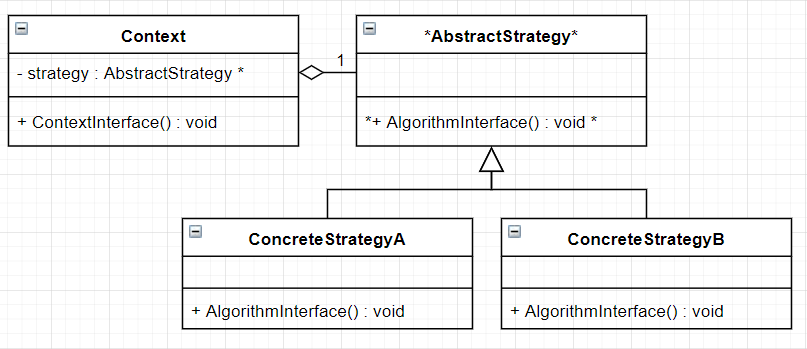

# Coupling and Cohesion
**Coupling** and **cohesion** are 2 measures of design quality

## Coupling
Coupling measures the degree of interdependence between software modules. A lower coupling is better. A high coupling is bad because:
1. Changes to one module requires greater changes to other modules
2. Harder to reuse individual modules

### Low to High Coupling
1. Modules communicate via function calls with basic parameters returns
2. Modules pass arrays/structs back and forth
3. Module affect each others control flow
4. Modules share global data
5. Modules that have access to eachs implementation (friends)

## Cohesion
Cohesion meausres how closely elements of a module are related to each other. A higher cohesion is better. A low cohesion is bad because:
1. Sign of poorly organized code
2. Hard to understand and maintain
3. Has many operations that don't have much in common

### High to Low Cohesion
1. Elements cooperate to perform exactly one task
2. Elements pass data to each other
3. Elements maniplate state over lifetime of an object, e.g. open/read/close files
4. Elements have a common theme, otherwise unrelated, perhaps share base code, e.g. <algorithm>
5. Arbitrary grouping of unrelated elements, e.g. <utility>

# Design Patterns
Software **design patterns** are general reusable solutions to commonly occurrring problems within a given context in software design. For example, using the concept of iterators with Linked Lists.
```cpp
class List {
    struct Node;
    Node *list = nullptr;
public:
    class Iterator {
        Node *p;
    public:
        explicit Iterator(Node *p) : p{p} {};
        int &operator*(){
            return p->data;
        }
        Iterator &operator++() {
            p = p->next;
            return *this;
        }
        bool operator ==(const Iterator &other) const {
            return p == other.p;
        }
        bool operator !=(const Iterator &other) const {
            return !(*this == other);
        }
        Iterator begin() {
            return Iterator(list);
        }
        Iterator end() {
            return Iterator(nullptr);
        }
    };
};

int main() {
    List lst;
    lst.addToFront(1);
    lst.addToFront(2);
    lst.addToFront(3);

    for (auto it = lst.begin(); it != lst.end; ++it){
        cout << *it << end;
    }
    // OR
    for (auto n : lst) {
        cout << n << endl;
    }
}
```

# Observer Pattern


**Observer pattern** is used to establish a one-to-many dependecy between objects so that when one object changes state, all its dependents are notified and updated automatically. 

The general structure has:
1. ```AbstractSubject```
   * keeps track of observers
   * allows adding and removing of observers
   * notifies observers when subject's state changes
2. ```ConcreteSubject```
   * the "real" class that implements the ```AbstractSubject```
   * its change will notify the observers
3. ```AbstractObserver```
   * an abstract class that defines the method that should be called whenever there is a change
4. ```ConcreteObserver```
   * the class that needs to keep itself updated with changes
   * implmenets the ```AbstractObserver```
   * registers itself with the ```ConcreteSubject```

For example, the observer pattern could be used to keep track of a product's price, and any changes to its price will update the various stores that sell it. In this case:
1. Subject: product
2. Observers: stores
3. When price updates, it calls ```notifyObservers()``` which calls ```notify()``` on each store.

```cpp
// AbstractSubject
class Subject {
    std::vector<Shop*> observers;
public:
    void attach(Observer* o) { observers.push_back(o); }
    void detach(Observer* o) {
        list.erase(std::remove(list.begin(), list.end(), o), list.end());
    }
    void notifyObservers(float price) {
        for (auto o : observers) {
            o->notify(price);
        }
    }
}

// ConcreteSubject
class Product : public AbstractSubject {
public:
    void updatePrice(float price) { notifyObservers(price); }
}

// AbstractObserver
class Observer {
public:
    virtual void notify(float price) = 0;
}

// ConcreteObserver
class Shop : public Observer {
    std::string name;
    float price;
public:
    Shop(std::string name) : name { name } {}
    void notify(float price) { this->price = price; }
}

int main() {
    Product p;
    Shop shop1("Shop1");
    Shop shop2("Shop2");

    // attach observers
    p.attach(shop1);
    p.attach(shop2);

    // update price and notify observers
    p.updatePrice(2.35);

    // Shop2 not looking to update price, so they unsubscribe
    p.detach(shop2);

    // only Shop1 is updated now
    p.updatePrice(2.30);
}
```

# Decorator Pattern


**decorator pattern** is used to attach responsibilities to an object dynamically. Inheritance is not feasible as it is static and applies to the entire class. The decorator pattern provides a flexible alternative to subclassing for extending functionality. It is dynamic and is applied to individual objects.

The general structure has:
1. ```Component```
   * "lowest common denominator"
   * abstract class for "base object" and the decorators
   * can be used on its own or wrapped by decorator
2. ```ConcreteComponent```
   * implments ```Component```
   * the object we're adding functionalities to
3. ```Decorator```
   * the extra functionality
   * implements ```Component``` (same as ```ConcreteComponent```)
   * has a pointer to a ```Component```
4. ```ConcreteDecorator```
   * the extra functionality
   * implements ```Component``` (same as ```ConcreteComponent```)
   * one is defined for each optional functionality
   * implements their "added functionality" and delegates it to the ```Decorator``` base class

```cpp
// Lowest common denominator
class Pizza {
public:
    virtual std::string description() = 0;
    virtual ~Pizza() {};
};

// ConcreteComponent (base object)
class CrustAndSauce: public Pizza {
public:
    // virtual method (override)
    std::string description() { return "Pizza"; }
};

// Decorator
class Decorator: public Pizza {
protected:
    Pizza *component;
public:
    Decorator(Pizza *component) : component{ component } {}
    Decorator::~Decorator() { delete component; }
};

// Decorator 1
class StuffedCrust: public Decorator {
public:
    StuffedCrust(Pizza *component) : Decorator{ p } {}
        // virtual
        std::string description() {
        // delegation to component and add extra functionality
        return component->description() + " with stuffed crust";
    }
};

// Decorator 2
class DippingSauce: public Decorator {
    std::string flavour;
public:
    DippingSauce(std::string flavour, Pizza *component) :
    Decorator{ p }, flavour{ flavour } {}
    // virtual
    std::string description() {
        // delegation to component and add extra functionality
        return component->description() + " with " + flavour + " dipping sauce";
    }
};

int main() {
    Pizza *p = new StuffedCrust(new DippingSauce("BBQ", new DippingSauce("Garlic", new CrustAndSauce)));
    cout << p->description();
    // Output: "Pizza with Garlic dipping sauce with BBQ dipping sauce with stuffed crust"
}
```

# Factory Method Pattern


**factory method pattern** uses factory methods to deal with the problem of creating objects without having to specify the exact class of the object being created. It allows classes to defer instantiation it uses to subclasses.

The general structure has:
1. ```AbstractProduct```
   * contains the factory method that creates the required subclass. Commonly implemented as a ```static``` function
2. ```ConcreteProduct```
   * the concrete subclasses that are actually returned

```cpp
// AbstractProduct
class Enemy {
public:
    // factory method
    static Enemy * createEnemy(const std::string type) {
        if (type == "turtle") return new Turtle;
        if (type == "bullet") return new Bullet;
        return NULL:
    }
};

// ConcreteProduct
class Turtle : public Enemy {};
class Bullet : public Enemy {};

int main() {
    Enemy *e = Enemy::createEnemy(turtle);
}
```

# Template Method Pattern


**template method pattern** defines the skeleton of an algorithm in a "template method". It defers some steps to subclasses to override by creating "placeholders". The derived classes then override these placeholders to complete the algorithm.

The general structure has:
1. ```AbstractClass```
   * contains the template method
   * contains abstract versions of the placeholder operations
2. ```ConcreteClass```
   * each ```ConcreteClass``` implements the full version of the algorithm by overriding all placeholder functions

```cpp
// AbstractClass
class Turtle {
public:
    // template method
    void draw() {
        drawHead();
        drawShell();
        drawFeet();
    }
private:
    void drawHead() {}
    void drawFeet() {}

    // placeholder method
    virtual void drawShell() = 0;
}

// ConcreteClassA
class RedTurtle : public Turtle {
  // override placeholder
  void drawShell override {
    // draw red shell
  }
}

// ConcreteClassB
class GreenTurtle : public Turtle {
  // override placeholder
  void drawShell override {
    // draw green shell
  }
}
```

# Non-Virtual Interface Idiom
Public virtual functions have the following uses:
1. Provides an interface to client. Indicates provided behaviour
2. Provides an interface to subclasses. Contains "hooks" for subclasses to insert specialized behaviour

If public virtual functions are wrapped in the function declaration, it would be difficult to separate (modularize) them.

Furthermore, pre and post conditions are useful to ensure that the class invariants are not violated during the execution of a program. It is important to modularize so we don't have repetitive checking of pre/post conditions and, potentially, forgetting to check them. It is useful to check them in one place, the base class. 

This is what the **Non-Virtual Interface (NVI)** idiom tries to accomplish. It separates customizable behaviour as private methods with non-customizable steps in between without changing public interface. 

Here is it's guidelines:
1. All public methods should be non-virtual, using the template design pattern
2. All virtual methods should be private (ideally except in the following case)
3. If derived class need to invoke the base implmentation of a virtual method, we make it protected
4. Base class destructor should be either public and virtual, or protected and nonvirtual

```cpp
// Without NVI Idiom
class DigitalMedia {
public:
    virtual void play() = 0;
    virtual ~DigitalMedia;
};

// With NVI Idiom
class DigitalMedia {
public:
    void play() { doPlay(); }
    virtual ~DigitalMedia();
    private:
    virtual void doPlay() = 0;
};
```

Advantages of NVI Idiom in above example:
* extra control over Play
* we can add before/after code around doPlay that can't change
* we can add mor "hooks" by calling additional virtual methods from play
* all this can be done without changing the public interface

# Visitor Pattern


**visitor pattern** is used to perform an extensible set of operations on an object structure without requiring any change to the structure. 

It can also be used to add functionality to existing classes without changing or recompiling classes. It allows us to create separate algorithms for different subclasses of the Element class by overloading the ```visit()``` method for each element class.

The general structure has:
1. ```AbstractVisitor```
   * interface that defines the logic supported
   * creates a ```visit(ConcreteElement)``` for each ```AbstractElement``` derived type
   * coupled with ```ConcreteElement```
2. ```ConcreteVisitor```
   * implements ```AbstractVisitor``` and its ```visit()``` methods
   * each ```ConcreteVisitor``` represents a different logic
   * create a class for each operation to be performed on the element objects
3. ```AbstractElement```
   * interface that defines the elements in the structure
   * creates an ```accept(AbstractVisitor)``` method that takes in an ```AbstractVisitor```
   * couplied with ```AbstractVisitor```
4. ```ConcreteElement```
   * implements ```AbstractElement``` and its ```accept()``` methods
   * each ```ConcreteElement``` represents a different structure
   * implements the ```accept(AbstractorVisitor)``` method by calling ```visit(*this)``` on the ```AbstractVisitor``` argument, which will apply the logic

```cpp
// AbstractElement
class Book {
public:
    virtual void accept(BookVisitor &v) = 0;
};

// ConcreteElement
class Novel : public Book {
public:
    Novel(std::string author) : author { author } {}
    void accept(BookVisitor &v) override { v.visit(*this); }
    std::string getAuthor() { return author; }
private:
    std::string author;
};

// ConcreteElement
class Text : public Book {
public:
    Text(std::string topic) : topic { topic } {}
    void accept(BookVisitor &v) override { v.visit(*this); }
    std::string getTopic() { return topic; }
private:
    std::string topic;
};

// ConcreteElement
class Comic : public Book {
public:
    Comic(std::string hero) : hero { hero } {}
    void accept(BookVisitor &v) { v.visit(*this); }
    std::string getHero() { return hero; }
private:
    std::string hero;
};

// AbstractVisitor
class BookVisitor {
public:
    virtual void visit(Book &b) = 0;
    virtual void visit(Text &t) = 0;
    virtual void visit(Comic &c) = 0;
};

// ConcreteVisitor
// Tracks how many of each type of book
// Groups novels by author, texts by topic, comics by hero
class Catalog : public BookVisitor {
    map theCatalog;
public:
    map getCatalog() { return theCatalog; }
    void visit(Book &b) { ++theCatalog[b.getAuthor()]; }
    void visit(Text &t) { ++theCatalog[t.getTopic()]; }
    void visit(Comic &c) { ++theCatalog[t.getHero()]; }
};

int main() {
    std::vector<Book> books;
    Novel harryPotter("J.K. Rowling");
    Text ctci("Programming");
    Comic spider("Spider-Man");

    books.push_back(harryPotter);
    books.push_back(ctci);
    books.push_back(spider);

    Catalog log;

    // call accept on each element and passing in visitor object
    for (auto& book : books) {
        book.accept(log);
    }
}
```

# PImpl Idiom
**PImpl (Pointer to Implementation) Idiom** is a C++ programming technique that hides the implementation details of a class by placing them in a separate class, which is accessed through an opaque pointer.

```cpp
// class.h
class Class {
    class Private; // forward declaration
    Private *pImpl;   // hide impl details
public:
    void foo();
};

// class.cc
#include "class.h"
    class Class::Private {
    // include actual class implementation
    void secretFoo() {}
}
Class::Class() : pImpl { new Private } {}
Class::~Class() { delete pImpl; }
void Class::foo() { pImpl->secretFoo(); }
```

We can forward declare the ```Private``` class because it is only used in the declaration of a pointer. Also note that any method in ```Class``` can have access to the mtheods in ```Private```, but the client does not know the implementation since ```Private``` hides the methods.

Advantages of PImpl Idiom:
1. Fully encapsulates a module
2. Hides implementation from client
3. Produces a stable interface
4. More readable class definitions
5. Hide implementation of Copy-swap idiom and move operations. This allows the assignment operators to be implemented ```inline``` without compromising encapsulation.

```cpp
class Class {
    // ...
    Class(const Class& other) {
      // calls copy ctor of Private class
      Private *pImpl = new Private(*(other->pImpl));
    }
    void swap(Class &other) {
        std::swap(pImpl, other.pImpl);
    }
    // Copy and Swap
    Class & operator=(const Class & other) {
        // call copy ctor of Class
        Class temp(other);
        swap(temp);
        return *this;
    }
    // Move Semantics
    Class(Class&& other) : pImpl(other.pImpl) { other.pImpl = nullptr; }
    Class & operator=(Class && other) {
        std::swap(pImpl, other.pImpl);
        return *this;
    }
    // ...
};
```

# Model-View-Controller (MVC) Pattern
Consider the following example:
```cpp
class ChessBoard {
    istream &in ;
    ostream &out;
public:
    ChessBoard(istream &in, ostream &out) : in{in}, out{out} {
        cout << "you move";
    }
};
```

**Single Responsibility Principle** - a class should have only one reason to change

The ```ChessBoard``` class should not be doing any communication at all. All user interactions should be confined outside the game class. This allows for total freedom to change how the game interacts. Also, as a rule of thumb, ```main``` should not be used to handle interactions as you may want to reuse or extend the communication code (hard to reuse code inside main). A solution is to separate the logic and the display, and have a class to manage interactions, such as the MVC pattern.

**MVC pattern** is an architectural pattern that separates an application into three main logical components:
1. ```Model```
   * the "brains"
   * handles the data-related logic that the user works with
   * can have multiple views (text, graphics)
   * doesn't need to know about their details
   * if an observer pattern is used, it plays the role of ```Subject```. Else it communicates through the ```Controller```
2. ```View```
   * the "display"
   * used for the UI logic
3. ```Controller```
   * the "interface" between ```Model``` and ```View``` components
   * mediates communication between ```Model``` and ```View```
   * may encapsulate turn-taking or entire game rules (tradeoff with ```Model```)
   * handles user input from ```View``` and updates ```Model```

# Strategy Pattern


**stategy pattern** is used to provide a means to define a family of algorithms, encapsulate each one and make them interchangeable. It allows the client to change the algorithm used dynamically.

The general structure has:
1. ```AbstractStrategy```
   * interface that provides the client with the generic algorithm
   * base abstract class that the family of algorithms derive from
2. ```ConcreteStrategy```
   * implements ```AbstractStrategy```
   * each class provides its own implementation of the algorithm provided by ```AbstractStrategy```

```cpp
// AbstractStrategy
class Sort {
public:
    virtual void sort(int arr[]) = 0;
}

// ConcreteStrategy
class Merge : public Sort {
public:
    // virtual
    void sort(int arr[]) { // merge sort }
}

// ConcreteStrategy
class Quick : public Sort {
public:
    // virtual
    void sort(int arr[]) { // quick sort }
}

// ConcreteStrategy
class Bogo : public Sort {
public:
    // virtual
    void sort(int arr[]) { // bogo sort }
}

class Select {
public:
    enum SortType { Merge, Quick, Bogo };
    Select() : strategy { nullptr } {}
    void setStrategy(int type);
    void sort(int arr[]);
private:
    Sort *strategy;
}

int main() {
    Select select;
    int nums[5];
    for (int &i : nums) {
        cout << "Enter a number:" << endl;
        cin >> i;  // Not exception-safe
    }
    cout << "Select a sort type: Merge(0) Quick(1) Bogo(2) Quit(3)";

    int choice;
    cin >> choice;

    if (choice == 3) return 0;

    select.setStrategy(choice);
    select.sort(nums);

    for (int i : nums) cout << i << " ";
    
    return 0;
}
```
